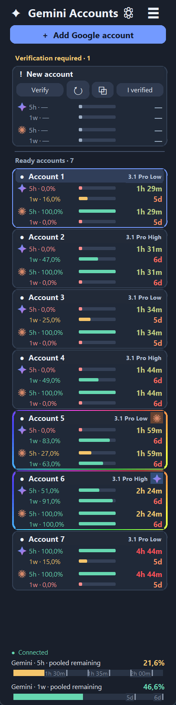

# Gemini Accounts

Google Antigravity account manager with Gemini / Claude quota monitoring and a local gateway for Claude Code and Codex. English interface and documentation. Available as a **Windows desktop app** and a **terminal app for Windows, macOS and Linux**.

## Windows desktop: three steps



Screenshot uses demo accounts and example quota values.

1. [Download GeminiAccounts-Setup.exe](https://github.com/nikitaeight24family/GeminiAccounts/releases/latest/download/GeminiAccounts-Setup.exe) and click **Install**. No Python or administrator access required.
2. Click **Add Google account** and complete browser sign-in. If Google requires verification, its page opens and the account stays pinned above ready accounts until verification succeeds.
3. Open **Connect applications** and approve setup of installed clients. Original configs are backed up. Restarting running clients requires separate consent.

A desktop shortcut is created. Updates preserve accounts and configurations; active requests block an update. Install Claude / Codex clients separately.

## Terminal: Windows, macOS and Linux

Download the matching CLI archive from [Releases](https://github.com/nikitaeight24family/GeminiAccounts/releases/latest), extract it and open a terminal in that folder. Python is included. The first run downloads a checksum-verified native service.

| Platform | Archive | Start |
| --- | --- | --- |
| Windows x64 | `GeminiAccounts-CLI-windows-x64.zip` | `.\GeminiAccounts-CLI.exe` |
| Mac with Apple Silicon | `GeminiAccounts-CLI-macos-arm64.tar.gz` | `./gemini-accounts` |
| Mac with Intel | `GeminiAccounts-CLI-macos-x64.tar.gz` | `./gemini-accounts` |
| Linux x64 | `GeminiAccounts-CLI-linux-x64.tar.gz` | `./gemini-accounts` |

Use the interactive menu for sign-in, quotas, verification, client setup and restoration. Keep it open while using clients. **Ctrl+C / Exit** stops services started by that terminal and preserves accounts. Services already running from another instance are reused and are not stopped on exit.

Mac executables are not notarized. macOS may require approval in **System Settings → Privacy & Security**. Source launch is also available. See the [terminal guide](CLI.md).

## Connections and restoration

| Client | Changes after approval |
| --- | --- |
| Claude Desktop on Windows | Local gateway preset for the **Code** tab; Gemini Pro / Flash aliases and available Claude models. Ordinary web chats retain their own connection. |
| Claude Code CLI, all supported platforms | Gateway URL, local key, model defaults and quota-wait settings merged into `~/.claude/settings.json`. Start with `claude`; continue with `claude --resume`. |
| Codex Desktop on Windows / Codex CLI | Responses API provider and default model in `~/.codex/config.toml`; separate `gemini-accounts.config.toml` for modern `codex --profile gemini-accounts`. |

Before any changes, the app lists affected files and asks for consent. Projects, sign-ins and session history are preserved. History is not transferred between applications. Organizational policies may prevent third-party providers. Automatic Claude Desktop setup and desktop client restarting are Windows-only; Mac terminal mode configures Claude Code CLI and Codex CLI.

**Restore:** desktop **☰ → Connect applications → Restore previous settings / reset preferences**, or terminal `./gemini-accounts restore`. After confirmation, exact original configs are restored and files that did not exist before setup are removed. Later edits to those files are replaced by their original backups. App preferences return to defaults. **Google sign-ins are kept.** Restart clients afterward.

## Features

- **⚙ next to Gemini Accounts → Choose models:** two independent lists: **Claude (Antigravity)** with available Haiku / Sonnet / Opus models, and **Gemini** with Pro Low / High, Flash and Lite. Applies to new gateway requests. Updating connected client menus and defaults is optional and asks permission; restart clients afterward. Availability follows your account catalog. Explicit Gemini Flash requests remain unchanged so quota pings stay cheap.
- Four account quota bars: Gemini / Claude, **5h / 1w**, with reset countdowns and time-based colors.
- Compact cards, sorted by Gemini's five-hour reset, with verification accounts pinned separately.
- Pooled Gemini 5h / 1w bars with vertical markers for projected quota after exhausted windows reset.
- Last requested model in card headers; independent last-used Gemini and Claude subscription badges.
- Prioritizes available accounts by the nearest **5h** reset for the ranked model family. Weekly quota determines whether the account can be used; its countdown does not change the five-hour order. Native failover switches exhausted accounts. Gemini and Claude can use different accounts simultaneously.
- Request, failure and switch statistics with reasons.
- Streaming keep-alives while waiting for genuine quota blocks; the real response follows when quota is available. Client cancellation cancels the wait. Pending requests are not saved to disk.
- Waits three minutes after detecting a full 5h quota before a minimal `Hi` request with one output token through Gemini Flash / GPT-OSS, unless client work already starts the window. Exhausted weekly quotas are skipped.
- Quotas update every minute. Desktop countdowns update every 15 seconds. Terminal monitoring runs while the menu / `serve` is open.

## Availability and storage

Google Antigravity determines account eligibility, models and quotas. A Gemini web subscription alone does not guarantee access to Claude or every model. This is an independent project, not an official Google, Anthropic or OpenAI application.

Gateway: `127.0.0.1:8317`; native service: `127.0.0.1:8318`. Both are local-only. Each installation receives random keys. Releases contain no personal sign-ins, private keys or history.

Windows uses LocalAppData, or an existing Codex LocalCache installation. macOS uses `~/Library/Application Support/GeminiAccounts`; Linux uses `$XDG_DATA_HOME/GeminiAccounts` or `~/.local/share/GeminiAccounts`. `GEMINI_ACCOUNTS_HOME` selects an explicit runtime root. Google sign-ins are in `ClaudeGemini/auth/`.

Windows protects management keys, verification state and backups with **DPAPI**. Mac / Linux encrypt these files with **Fernet** and a user-only local storage key; this is file-permission protection, not Keychain integration. Keep the storage key with the protected data. Never publish installed auth folders, keys or client configs.

## Development

Python 3.12+. Desktop: `requirements.txt`; terminal-only: `requirements-cli.txt` (no Tk or GUI dependencies).

```sh
python -m pip install -r requirements-cli.txt
python console.py --help
python -m unittest tests.test_console tests.test_accounts tests.test_activity tests.test_quota_queue tests.test_quota_starts tests.test_routing
```

Windows build: `build-release.ps1`. Terminal binary: `python -m PyInstaller --onefile --name gemini-accounts --collect-all tzdata console.py`. GitHub Actions builds and tests Windows, Mac Apple Silicon / Intel and Linux editions. Native CLIProxyAPI is pinned to **8.0.16**, with committed SHA-256 checksums and its license included. Client configuration interfaces may change with client updates.

Documentation: [Codex configuration](https://learn.chatgpt.com/docs/config-file/config-advanced), [Claude Code environment variables](https://code.claude.com/docs/en/env-vars), [CLIProxyAPI](https://github.com/router-for-me/CLIProxyAPI).
